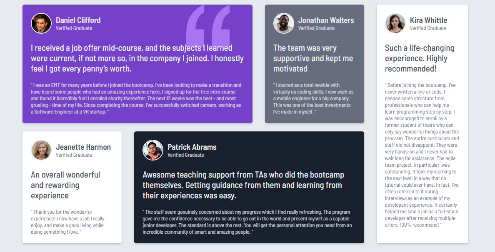

# Frontend Mentor - Testimonials grid section solution

This is a solution to the [Testimonials grid section challenge on Frontend Mentor](https://www.frontendmentor.io/challenges/testimonials-grid-section-Nnw6J7Un7). Taking on challenges like these is an excellent way to enhance coding skills, tackle realistic problems, and boost confidence in frontend development. Keep pushing yourself—you’ve got this!

## Table of contents

- [Overview](#overview)
  - [The challenge](#the-challenge)
  - [Screenshot](#screenshot)
  - [Links](#links)
- [My process](#my-process)
  - [Built with](#built-with)
  - [What I learned](#what-i-learned)
  - [Continued development](#continued-development)
  - [Useful resources](#useful-resources)
- [Author](#author)
- [Acknowledgments](#acknowledgments)

## Overview

### The challenge

Users should be able to:

- View the optimal layout for the site depending on their device's screen size.

### Screenshot




### Links

- Solution URL: [[Frontend Mentor](https://www.frontendmentor.io/solutions/testimonials-section-grid-design-zQDlzJzyRg)]
- Live Site URL: [[GitHub Pages](https://youssef-mohammad.github.io/Testimonials.io/)]

## My process

### Built with

- Semantic HTML5 markup
- CSS custom properties
- Flexbox
- Mobile-first workflow

### What I learned

This project was a rewarding challenge and offered plenty of growth opportunities. Here are a few key highlights:

```html
<h1>Simple yet effective HTML</h1>
```

```css
@media only screen and (min-width: 576px) {
    #testimonial-grid-container,
    #main-left,
    #top-left,
    #bottom-left{
        display: flex;
    }
```

### Continued development

I aim to keep refining my skills in responsive design and accessibility best practices. Additionally, exploring ways to optimize performance and enhance user experience will remain a top focus in future projects.

### Useful resources

- [https://developer.mozilla.org/en-US/](https://developer.mozilla.org/en-US/) - Resources for developers, by developers.
- [https://www.w3schools.com/](https://developer.mozilla.org/en-US/) - It offers a wide range of services and products for beginners and professionals,
helping millions of people everyday to learn and master new skills.

## Author

- Website - [Youssef Mohammed](https://github.com/Youssef-Mohammad)
- Frontend Mentor - [@Youssef-Mohammad](https://www.frontendmentor.io/profile/Youssef-Mohammad)
- Linkedin - [@Youssef-Mohammad](https://www.linkedin.com/in/yussef-mohamed-900b44161/)

## Acknowledgments

A big shoutout to everyone who encouraged me to keep going and refining my skills. Your support has been a driving force behind this project!

---

Stay motivated and keep building! The satisfaction of seeing your project come to life is always worth the effort. 🚀
